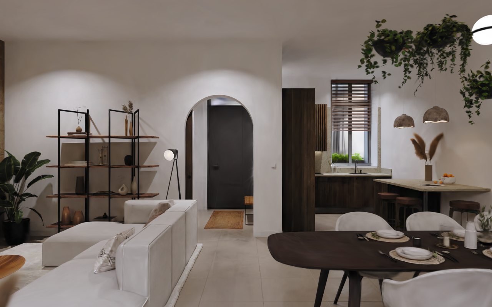
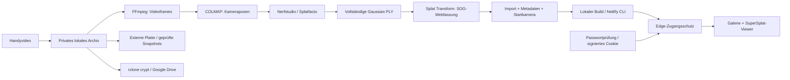

# Room Memories

Ein privates, begehbares Erinnerungsarchiv: Handyvideo → Kameraposen → Gaussian Splat → geschützte Webgalerie.

[Private Website](https://rooms.maxim.tk) · [RTX-Einrichtung](docs/RTX.md) · [Backup & Restore](docs/BACKUP.md)

[](demo/demo.mp4)

[Demovideo ansehen](demo/demo.mp4) – Stephane Agullo, CC BY 4.0. Die Kamera bewegt sich durch die vorhandene Szene; es sind keine eigenen Trainingsmesswerte.

Dieses Projekt verbindet bestehende Computer-Vision-Technik mit einer eigenen Anwendung. Eigene Arbeit: Galerie, Hierarchie, Viewer-Integration, Zugangsschutz, Import, Verarbeitungsskripte, Veröffentlichung und überprüfbare Backups. Rekonstruktionsalgorithmen stammen aus **COLMAP**, **Nerfstudio/Splatfacto** und **gsplat**. Ein Fork ist für diese Integration nicht nötig.

## Was schon funktioniert

- Wohnungen als Kategorien, darunter Zimmer oder eine zusammenhängende Wohnungsaufnahme.
- Suche, Sortierung, Titel, Aufnahmedatum, Beschreibung, Vorschaubild und gespeicherte Startkamera.
- SuperSplat-Viewer mit Maus/Touch, Zoom, Flugmodus, Vollbild und Rückkehr zur Startansicht. Modelldatei und Viewer-Code laden erst beim Öffnen.
- Serverseitige Passwortprüfung; signierte 24-Stunden-Sitzung im HttpOnly-/Secure-/SameSite-Cookie.
- Edge-Zugangsschutz für Galerie, Katalog, Vorschaubilder und Modelldateien – auch auf Netlify-Ursprungs- und Deploy-Adressen. Keine öffentlichen privaten Datei-URLs, kein Passwort im Browser-Code.
- Lokaler Import gebündelter SOG- oder Gaussian-Splat-PLY-Dateien. PLY → SOG wird mit PlayCanvas Splat Transform auf der CPU konvertiert.
- Befehle für Netlify-Veröffentlichung, unveränderliche Backup-Snapshots, SHA-256-Prüfung und Wiederherstellung.

Die mitgelieferte Beispielwohnung ist **SA3D_R&D_XP47 von Stephane Agullo, CC BY 4.0** ([Lizenz/Quelle](demo/ATTRIBUTION.md)). Sie dient der Viewer-Demo. Es wurde dafür kein eigenes Video rekonstruiert. Trainingsqualität und Verarbeitungszeiten werden erst nach dem ersten echten GPU-Durchlauf dokumentiert.

## Architektur



Das öffentliche Repository enthält Anwendungscode und die freigegebene Demo. Deine Videos, Räume, Trainingsdaten und Geheimnisse liegen außerhalb von Git. Ein Netlify-Build aus dem öffentlichen Repo kann deine privaten Räume nicht herstellen; veröffentlicht wird lokal aus deinem Archiv.

## Lokal ansehen

Voraussetzungen: Node.js **24**, npm, Python **3.10+**; RTX-Verarbeitung zusätzlich Docker/WSL2. Der Webviewer benötigt WebGL2, aber keine NVIDIA-GPU. Die Testausführung verwendet die eingebaute TypeScript-Unterstützung von Node 24.

```bash
git clone https://github.com/Mjakinin/room-memories.git
cd room-memories
npm ci
npm run build
npm run dev
```

`http://127.0.0.1:5173` ist eine **lokale Entwickleransicht ohne Auth-Middleware**. Sie bindet nur an den lokalen Computer. Nicht mit `--host 0.0.0.0` im Netzwerk freigeben. Zugangsschutz unter Netlify oder mit `netlify dev` testen. Für echtes Laptop-Training ist die optionale Brush-Erprobung getrennt vorgesehen.

## Raum importieren

Zuerst [RTX-Pipeline](docs/RTX.md) ausführen. Danach ein Vorschaubild und die Startansicht vorbereiten, z.B. in einer lokalen SuperSplat-Instanz. Es handelt sich um Gaussian Splats, nicht um ein CAD-Modell mit wasserdichten Oberflächen oder einer automatisch verstandenen Raumsemantik.

```bash
npm run rooms -- apartment --id berlin --title "Berlin · Wohnung" \
  --description "Die Wohnung in Berlin."

npm run rooms -- import --id berlin-wohnzimmer --apartment berlin \
  --title "Wohnzimmer" --date 2026-10-04 \
  --description "Ein Abend im vertrauten Wohnzimmer." \
  --model /pfad/splat.ply --poster /pfad/vorschau.jpg \
  --settings /pfad/settings.json --video /pfad/wohnzimmer.mp4
```

`--settings` und `--video` sind optional. Ohne Einstellungen startet eine Standardkamera; für eigene Szenen eine passende Startkamera verwenden. Der Import akzeptiert binäre Gaussian-Splat-PLY, keine gewöhnliche Punktwolke/Mesh-PLY. Nerfstudio-Exporte mit explizitem Z-up-Kommentar werden für die Webfassung ausgerichtet; die volle Originaldatei bleibt erhalten. SOG muss eine gebündelte `.sog`-Datei sein. Für eine ganze Wohnung zusätzlich `--kind apartment` setzen. Wiederholte IDs werden abgewiesen.

Startkamera nachträglich ändern:

```bash
npm run rooms -- view --id berlin-wohnzimmer --settings /pfad/settings.json
npm run rooms -- list
```

Standardarchiv: `private/archive/`. Für eine andere Platte immer denselben `ROOM_ARCHIVE`-Pfad bei Import, Build, Veröffentlichung und Backup setzen. Änderungen an Kategorien/Startansicht werden erst nach neuer Veröffentlichung online sichtbar.

## Auf Netlify veröffentlichen

```bash
npm install -g netlify-cli
netlify login
netlify link --id DEINE_SITE_ID
npm run password
npm run publish
```

Das generierte Passwort steht ausschließlich in `.local/access.txt`; `.env` enthält Hash und Sitzungsschlüssel. Beide sind von Git ausgeschlossen. `publish` baut die Website, importiert Geheimnisse für alle Deploy-Kontexte und lädt statische Dateien, Functions und Edge-Middleware gemeinsam hoch. Die CLI-Anmeldung bleibt in deinem Netlify-Konto. Passwortwechsel: `npm run password -- --rotate`, danach `npm run publish`. Damit werden alte Sitzungen ungültig. Nie `dist/` ohne Middleware bei einem anderen Hoster veröffentlichen.

Private SOGs liegen im geschützten Netlify-Deploy; der Originalarchivbestand bleibt auf deinen Datenträgern. Dateigrößen variieren mit Aufnahme, Punktzahl und Kompression. Es werden keine pauschalen Größen-/Qualitätsversprechen gemacht. Häufige große Downloads verbrauchen Netlify-Bandbreite, Snapshots verbrauchen Platten-/Drive-Speicher. Verwendet wird der vorhandene kostenlose Tarif, keine bezahlten Zusatzdienste oder Planwechsel.

## Prüfen

```bash
npm test
npm run build
npx playwright install chromium --only-shell
# npm run dev in einem zweiten Terminal:
node scripts/capture-demo.mjs
# Nach Veröffentlichung; Zugang wird aus deiner lokalen Datei gelesen:
node scripts/verify-deploy.mjs
```

Tests decken Sitzungssignaturen/Expiry, Passwortprüfung, Login-Ursprung, private direkte Downloads, Kategorien und vollständige Backup-Wiederherstellung ab. Der Deployment-Test prüft echte HTTP-Antworten auf Netlify-Ursprungs- und Deploy-Adressen. Browserprüfungen verwenden eine frei lizenzierte Szene. Externe Backup-Platte, Google-OAuth und RTX-Training müssen auf deiner Hardware geprüft werden.

## Nächster echter Durchlauf

1. RTX-Setup starten, Video aufnehmen und verarbeiten.
2. PLY/SOG, Vorschau und Startansicht importieren; privat veröffentlichen.
3. Externe Platte auswählen und Google Drive mit rclone crypt verbinden; Sicherung/Wiederherstellung durchführen.
4. Dieselbe Aufnahme mit [LichtFeld Studio](https://github.com/MrNeRF/LichtFeld-Studio) vergleichen. Qualität, echte Dauer, Original-/Webgröße dokumentieren. Optional [Brush](https://github.com/ArthurBrussee/brush) auf dem Laptop testen.

## Verwendete Projekte

| Projekt | Rolle | Lizenz |
| --- | --- | --- |
| [Nerfstudio](https://github.com/nerfstudio-project/nerfstudio) / [gsplat](https://github.com/nerfstudio-project/gsplat) | Splatfacto-Training und PLY-Export | Apache 2.0 |
| [COLMAP](https://github.com/colmap/colmap) | Bildmerkmale und Kameraposen | BSD |
| [FFmpeg](https://ffmpeg.org/) | Videoframes | LGPL/GPL je Build |
| [SuperSplat Viewer](https://github.com/playcanvas/supersplat-viewer) / [PlayCanvas](https://github.com/playcanvas/engine) | Webdarstellung | MIT |
| [Splat Transform](https://github.com/playcanvas/splat-transform) | PLY/SOG-Konvertierung | MIT |
| [rclone](https://rclone.org/crypt/) | Verschlüsselte Drive-Sicherung | MIT |

Der Anwendungscode ist MIT-lizenziert; Beispielassets separat CC BY 4.0. Versionen der npm-Abhängigkeiten stehen im Lockfile. Der GPU-Setup hält den tatsächlich verwendeten Container-Digest fest.
