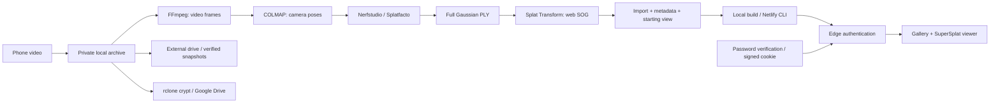

# Room Memories

A private archive of spaces you want to remember: phone video → camera poses → Gaussian splat → protected web gallery.

[RTX setup](docs/RTX.md) · [Backup & restore](docs/BACKUP.md)

[](demo/demo.mp4)

[Watch the demo](demo/demo.mp4) — scene by Stephane Agullo, CC BY 4.0. The camera moves through an existing scene; this demonstrates the viewer rather than reconstruction performance.

Room Memories combines existing computer vision tools with a custom application. The application provides the gallery, apartment/room hierarchy, viewer integration, authentication, import workflow, processing scripts, deployment and verified backups. Reconstruction uses **COLMAP**, **Nerfstudio/Splatfacto** and **gsplat**. No changes to their algorithms or source code are required.

The deployed archive is private. This public repository contains the application and a licensed demo for review. The website interface is in German; project documentation is in English.

## Features

- Apartments as categories, containing individual rooms or a continuous whole-apartment capture.
- Search, sorting, titles, capture dates, descriptions, thumbnails and saved starting views.
- SuperSplat viewer with mouse/touch navigation, zoom, fly mode, fullscreen and camera reset. Viewer code and model files load only when a scene is opened.
- Server-side password verification and signed 24-hour sessions using HttpOnly, Secure and SameSite cookies.
- Edge authentication for the gallery, catalog, thumbnails and model files, including direct Netlify origin and deploy URLs. Passwords are never embedded in browser code.
- Local import of bundled SOG or Gaussian-splat PLY files. PlayCanvas Splat Transform converts PLY to SOG on the CPU.
- Commands for Netlify deployment, versioned backup snapshots, SHA-256 verification and restoration.

The included example apartment is **SA3D_R&D_XP47 by Stephane Agullo, CC BY 4.0** ([attribution and source](demo/ATTRIBUTION.md)). It demonstrates the viewer and was not reconstructed from our own video. Training quality and processing times will be documented after the first real GPU run.

## Architecture



Private videos, captures, training data and credentials stay outside Git. A Netlify build from this public repository cannot include private rooms; those are deployed locally from your archive.

## Run locally

Requirements: Node.js **24**, npm and Python **3.10+**. RTX processing also requires Docker/WSL2. The web viewer requires WebGL2 but does not require an NVIDIA GPU. Tests use Node 24's built-in TypeScript support.

```bash
git clone https://github.com/Mjakinin/room-memories.git
cd room-memories
npm ci
npm run build
npm run dev
```

`http://127.0.0.1:5173` is a **local development preview without authentication middleware**. It binds to the local computer only; do not expose it to your network with `--host 0.0.0.0`. Test authentication on Netlify or with `netlify dev`. An optional Brush experiment for laptop training is planned separately.

## Import a room

Run the [RTX pipeline](docs/RTX.md), then prepare a thumbnail and starting view, for example in a local SuperSplat instance. Captures are Gaussian splats, not watertight CAD models or automatically inferred room semantics.

```bash
npm run rooms -- apartment --id berlin --title "Berlin apartment" \
  --description "Our apartment in Berlin."

npm run rooms -- import --id berlin-living-room --apartment berlin \
  --title "Living room" --date 2026-10-04 \
  --description "An evening in the living room." \
  --model /path/to/splat.ply --poster /path/to/thumbnail.jpg \
  --settings /path/to/settings.json --video /path/to/living-room.mp4
```

`--settings` and `--video` are optional. Without settings, the viewer uses a default camera; choose a suitable starting view for your own scenes. Import accepts binary Gaussian-splat PLY, not ordinary point-cloud or mesh PLY. Nerfstudio exports with an explicit Z-up comment are aligned for the web copy while the complete original file is preserved. SOG must be a bundled `.sog` file. Use `--kind apartment` for a whole-apartment capture. Duplicate IDs are rejected.

Update a starting view:

```bash
npm run rooms -- view --id berlin-living-room --settings /path/to/settings.json
npm run rooms -- list
```

The default archive is `private/archive/`. To use another drive, set the same `ROOM_ARCHIVE` path for import, build, deployment and backup. Category and camera changes become available online after deployment.

## Deploy to Netlify

```bash
npm install -g netlify-cli
netlify login
netlify link --id YOUR_SITE_ID
npm run password
npm run publish
```

The generated password is stored only in `.local/access.txt`; `.env` contains its hash and the session secret. Both files are excluded from Git. `publish` builds the website, imports secrets for all deploy contexts and uploads static files, functions and edge middleware together. CLI authentication uses your Netlify account. To rotate credentials, run `npm run password -- --rotate`, then `npm run publish`; existing sessions become invalid. Never publish `dist/` on another host without the authentication middleware.

Private SOG files are included in the protected Netlify deploy; the original archive stays on your drives. File sizes depend on the capture, splat count and compression. Large downloads consume Netlify bandwidth, and snapshots consume disk and Drive storage. The project uses the existing free Netlify plan, with no paid services or plan changes.

## Validation

```bash
npm test
npm run build
npx playwright install chromium --only-shell
# Start npm run dev in another terminal:
node scripts/capture-demo.mjs
# After deployment; credentials are read from your local file:
node scripts/verify-deploy.mjs
```

Tests cover session signatures and expiry, password verification, login origin checks, protected direct downloads, categories and backup restoration. Deployment checks test real HTTP responses on Netlify origin and deploy URLs. Browser checks use the licensed demo scene. The external backup drive, Google OAuth and RTX training still need validation on the target hardware.

## First real capture

1. Run the RTX setup, record a video and process it.
2. Import PLY/SOG, a thumbnail and camera settings; deploy privately.
3. Choose an external drive and connect Google Drive using rclone crypt; test backup and restoration.
4. Compare the same capture with [LichtFeld Studio](https://github.com/MrNeRF/LichtFeld-Studio). Document quality, actual processing time and original/web file sizes. Optionally test [Brush](https://github.com/ArthurBrussee/brush) on the laptop.

## Projects used

| Project | Role | License |
| --- | --- | --- |
| [Nerfstudio](https://github.com/nerfstudio-project/nerfstudio) / [gsplat](https://github.com/nerfstudio-project/gsplat) | Splatfacto training and PLY export | Apache 2.0 |
| [COLMAP](https://github.com/colmap/colmap) | Image features and camera poses | BSD |
| [FFmpeg](https://ffmpeg.org/) | Video frame extraction | LGPL/GPL depending on build |
| [SuperSplat Viewer](https://github.com/playcanvas/supersplat-viewer) / [PlayCanvas](https://github.com/playcanvas/engine) | Web rendering | MIT |
| [Splat Transform](https://github.com/playcanvas/splat-transform) | PLY/SOG conversion | MIT |
| [rclone](https://rclone.org/crypt/) | Encrypted Drive backups | MIT |

Application code is MIT-licensed; demo assets are separately licensed under CC BY 4.0. npm dependency versions are recorded in the lockfile. GPU setup records the exact container digest used.
